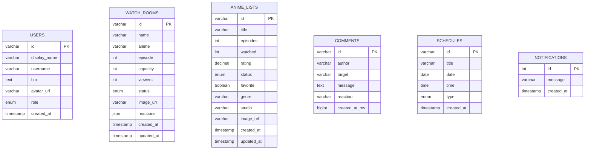

# OtakuHub Database ERD

This diagram shows the current MySQL tables used by the Flask backend.

## Notes

- `watch_rooms.reactions` stores anime-themed reaction counts as JSON.
- `anime_lists` stores tracking information such as total episodes, watched episodes, rating, favorite status, genre, studio, and poster URL.
- `comments.target` can refer to an anime title or watch room name.
- `schedules` powers the upcoming anime calendar and countdown tracker.
- `users` currently stores the demo profile and can support future login/signup work.
